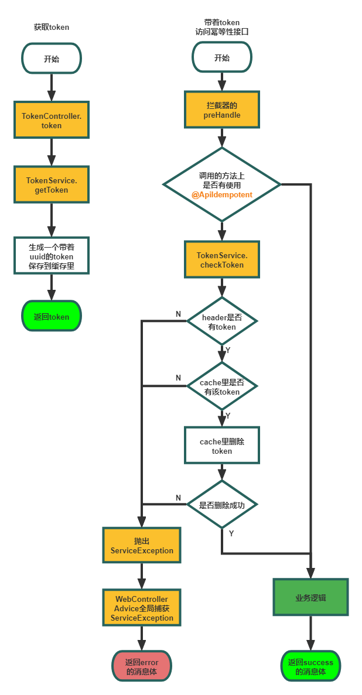

## 接口幂等性Demo的主要文件结构：

```
-annotation
	-ApiIdempotent	接口幂等性注解类
-cache
	-TimedLocalCache	具有过期回收功能的内部缓存
	-TimedLocalCachedDataDTO	缓存的实际value，包含插入时间和V
-common
	-ResponseCode	返回码枚举类
	-ServerResponse	服务响应类
	-ServiceException	接口幂等性验证封装的异常类
	-WebConfiguration	注册接口幂等性拦截器的配置类
	-WebControllerAdvice	全局捕获ServiceException的AOP类
-interceptor
	-IdempotentTokenInterceptor	接口幂等性拦截器
-service
	-TokenService
	-impl
		-TokenServiceImpl	获取和生成token的方法类
```


## 内部缓存实现：

​	**TimedLocalCache**为一个弱引用类型的可过期回收的concurrentHashMap。该类有一个timeout属性，用于保存超时时间；V实际为TimedLocalCachedDataDTO<V>,该类的属性是time和value，其中time是每次put时的当前时间。

​	putCache：新建一个封装好当前时间的TimedLocalCachedDataDTO<V>类，并执行map.put操作。

​	getCache：通过K获取TimedLocalCachedDataDTO，取出该对象的time(put时的时间)，然后对比当前时间，如果时间差大于timeout，则remove该KV，否则返回V。


## 关于不同引用类型进行垃圾回收的说明：

| 引用类型 | 被回收的时间 | 用途           | 生存时间           |
| -------- | ------------ | -------------- | ------------------ |
| 强引用   | 从不         | 对象的一般状态 | JVM停止运行时终止  |
| 软引用   | 在内存不足时 | 对象缓存       | 内存不足时gc后终止 |
| 弱引用   | 在垃圾回收时 | 对象缓存       | gc运行后终止       |


## 接口幂等性验证流程：

